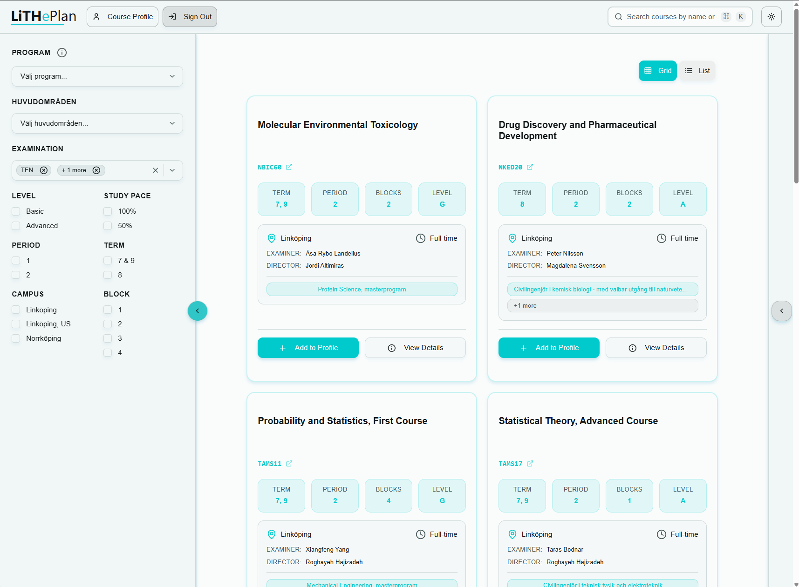

<div align="center">
  <picture>
    <source media="(prefers-color-scheme: dark)" srcset="public/LiTHePlan-white-transparent.png">
    <source media="(prefers-color-scheme: light)" srcset="public/LiTHePlan-transparent.png">
    
  </picture>
  
  # LiTHePlan
  
  **Intelligent course planning for Linköping University civil engineering students**
  
  [](https://nextjs.org/)
  [](https://react.dev/)
  [](https://www.typescriptlang.org/)
  [](https://supabase.com/)
  [](https://litheplan.tech)
  
  [Live Demo](https://litheplan.tech) · [Report Bug](https://github.com/Berkay2002/LiTHePlan/issues) · [Request Feature](https://github.com/Berkay2002/LiTHePlan/issues)
</div>

---

## 📸 Overview

<div align="center">
  
</div>

LiTHePlan is a modern web application that solves the course planning challenge for Linköping University (LiTH) civil engineering master's students. With **339 curated courses** across **29 program specializations**, students can discover cross-disciplinary opportunities, build validated 90hp study plans, and share profiles with academic advisors.

### The Problem

- **Fragmented Information**: Course data scattered across multiple university systems
- **Poor Discoverability**: No efficient way to explore courses across different programs
- **Manual Validation**: Time-consuming spreadsheet planning with error-prone requirement checking
- **Limited Cross-Specialization**: Students miss opportunities outside their default track

### The Solution

- 🔍 **Unified Course Catalog**: 339 master's level courses (terms 7-9) with advanced filtering
- 📌 **Interactive Profile Builder**: Visual drag-and-drop pinboard with real-time validation
- ✅ **Automatic Validation**: Ensures 90hp total and 60hp advanced-level requirements
- 🔗 **Profile Sharing**: Cloud-synced profiles with unique URLs for advisor collaboration
- 💾 **Hybrid Storage**: Guest users get localStorage persistence, authenticated users get cloud sync

---

## ✨ Key Features

### Smart Course Discovery
- **Comprehensive Catalog**: 339 curated master's level courses (terms 7-9) from 29 program specializations
- **Advanced Filtering**: Multi-criteria search by term, level, block, pace, campus, and program
- **Dual View Modes**: Toggle between grid and list layouts with server-side pagination
- **Conflict Detection**: Automatically identifies and resolves mutually exclusive course selections
- **Course Details**: Enhanced metadata including examiner, study director, and subject area

### Interactive Profile Builder
- **Visual Pinboard**: Drag-and-drop interface for organizing courses across 3 semesters
- **Real-time Validation**: Instant feedback on credit totals and degree requirement compliance
- **Mobile Optimized**: Touch-friendly interactions with responsive design
- **Term Management**: Add, remove, and move courses between terms with validation

### Academic Requirements
- **Credit Tracking**: Automatic calculation of total (90hp) and advanced-level (60hp) credits
- **Validation Indicators**: Color-coded feedback (green = valid, yellow = warning, red = error)
- **Conflict Resolution**: Smart modal system for handling course conflicts
- **Swedish Terminology**: Preserves official LiU academic terms (grundnivå, avancerad nivå)

### Profile Management
- **Hybrid Storage Pattern**: 
  - **Guest Mode**: Profiles stored locally with full functionality, no signup required
  - **Authenticated Mode**: Cloud-synced via Supabase with cross-device access
  - **Graceful Fallback**: Automatic localStorage fallback if cloud sync fails
- **Profile Sharing**: Generate unique URLs to share study plans with advisors
- **Multi-Device Sync**: Real-time profile updates across browsers and devices

---

## 🛠 Tech Stack

### Frontend
- **Next.js 16.0.1** with App Router (Server Components by default)
- **React 19.2** with TypeScript 5 (strict mode)
- **Tailwind CSS v4** with PostCSS architecture
- **shadcn/ui** component library (built on Radix UI primitives)
- **Lucide React** icons

### Backend & Data
- **Next.js API Routes** for serverless backend
- **Supabase** (PostgreSQL) with 339 curated courses
- **Row-Level Security (RLS)** for data protection
- **Real-time Subscriptions** for profile sync

### State Management
- **React Context API** with useReducer for global profile state
- **ProfileProvider** wrapping entire application
- **Type-safe operations** with TypeScript interfaces

### Developer Experience
- **Ultracite** (Biome-based) linting with 200+ strict rules
- **TypeScript** strict mode (no `any` types allowed)
- **Playwright** for end-to-end testing
- **Sentry** error tracking and monitoring
- **Upstash Redis** for API rate limiting

### Production Infrastructure
- **Vercel** deployment with edge functions
- **Rate Limiting**: Sliding window algorithm (100 req/min for catalog, 10 req/min for writes)
- **Structured Logging**: JSON logs with request correlation IDs
- **Input Validation**: Zod schemas with strict mode (prevents injection attacks)
- **HTTP Caching**: TTL-based caching (5min client, 10min CDN for courses)

---

## 🚀 Getting Started

### Prerequisites
- Node.js 18.18.0 or higher
- npm, yarn, or pnpm
- Supabase account (free tier)

### Installation

1. **Clone the repository**
   ```bash
   git clone https://github.com/Berkay2002/LiTHePlan.git
   cd LiTHePlan
   ```

2. **Install dependencies**
   ```bash
   npm install
   ```

3. **Set up environment variables**
   
   Create `.env.local` in the project root:
   ```bash
   # Supabase
   NEXT_PUBLIC_SUPABASE_URL=https://xxx.supabase.co
   NEXT_PUBLIC_SUPABASE_ANON_KEY=your_anon_key
   NEXT_PUBLIC_SUPABASE_PUBLISHABLE_KEY=your_publishable_key
   SUPABASE_SECRET_KEY=your_secret_key
   SUPABASE_SERVICE_ROLE_KEY=your_service_role_key

   # Sentry (Optional - Error Tracking)
   SENTRY_AUTH_TOKEN=your_sentry_token
   SENTRY_ORG=your_org
   SENTRY_PROJECT=your_project

   # Upstash Redis (Optional - Rate Limiting)
   UPSTASH_REDIS_REST_URL=https://xxx.upstash.io
   UPSTASH_REDIS_REST_TOKEN=your_token
   ```

4. **Start the development server**
   ```bash
   npm run dev
   ```

5. **Open your browser**
   
   Navigate to [http://localhost:3000](http://localhost:3000)

### Available Scripts

```bash
npm run dev          # Start development server (localhost:3000)
npm run build        # Production build with TypeScript checking
npm start            # Serve production build
npm run lint         # Run Ultracite linter
npm run format       # Auto-fix code style
npm run test         # Run Playwright tests
npm run test:ui      # Open Playwright test UI
```

---

## 📁 Project Structure

```
LiTHePlan/
├── app/                          # Next.js App Router
│   ├── page.tsx                 # Home page (course catalog)
│   ├── layout.tsx               # Root layout with ProfileProvider
│   ├── api/                     # API routes
│   │   ├── courses/route.ts    # Course filtering & pagination
│   │   ├── profile/route.ts    # Profile CRUD operations
│   │   └── auth/               # Supabase authentication
│   ├── login/                  # Authentication pages
│   ├── profile/                # Profile management
│   │   ├── [id]/page.tsx       # View shared profiles
│   │   └── edit/page.tsx       # Edit profile
│   └── course/[courseId]/      # Individual course pages
│
├── components/
│   ├── course/                 # Course discovery features
│   │   ├── CourseCard.tsx     # Course display component
│   │   ├── FilterPanel.tsx    # Multi-select filters
│   │   ├── ConflictResolutionModal.tsx
│   │   └── TermSelectionModal.tsx
│   ├── profile/               # Profile builder
│   │   ├── ProfileContext.tsx # Global state (CRITICAL)
│   │   ├── ProfilePinboard.tsx # Drag-drop interface
│   │   └── ProfileSidebar.tsx  # Credit tracking
│   ├── shared/                # Reusable components
│   │   ├── DynamicNavbar.tsx
│   │   ├── GlobalCommandPalette.tsx
│   │   └── AlertBanner.tsx
│   └── ui/                    # shadcn/ui primitives
│
├── lib/
│   ├── profile-utils.ts       # Profile CRUD logic
│   ├── course-conflict-utils.ts # Conflict detection
│   ├── api-validation.ts      # Zod schemas
│   ├── rate-limit.ts          # Redis rate limiting
│   └── logger.ts              # Structured logging
│
├── types/
│   ├── course.ts              # Course interfaces
│   └── profile.ts             # Profile state types
│
├── utils/supabase/
│   ├── client.ts              # Browser Supabase client
│   ├── server.ts              # Server Supabase client (SSR)
│   └── session.ts             # Auth utilities
│
├── proxy.ts                    # Auth session refresh (Next.js 16)
└── memory-bank/               # Project documentation
```

---

## 🗄 Database

### Course Database

**339 curated courses** from Linköping University's master's level programs (terms 7-9), covering **15 civil engineering programs** and additional specialization areas.

**Statistics:**
- **Advanced Level**: 79.4% (269 courses)
- **Basic Level**: 20.6% (70 courses)
- **Linköping Campus**: 83.2% (282 courses)
- **Norrköping Campus**: 15.6% (53 courses)
- **Standard 6hp Courses**: 89.7% (304 courses)

**Programs Covered:**
Civil engineering programs in Computer Science, Electrical Engineering, Mechanical Engineering, Industrial Engineering, Biomedical Engineering, Media Technology, Applied Mathematics, and more.

### Data Management

> **Note on Data Currency**: The course database is maintained through an automated crawler that runs periodically (every 3-6 months) to update course information, remove deprecated courses, and add new offerings. While this ensures reasonable data freshness, always verify critical course details with official Linköping University sources and your academic advisor before finalizing your study plan.

**Database Schema:**

```sql
-- courses table (339 active courses)
CREATE TABLE courses (
  id TEXT PRIMARY KEY,              -- Course code (e.g., 'TSBK02')
  name TEXT NOT NULL,
  credits NUMERIC NOT NULL,         -- HP (usually 6)
  level TEXT NOT NULL,              -- 'grundnivå' | 'avancerad nivå'
  term TEXT[] NOT NULL,             -- ['7', '8', '9']
  period TEXT[] NOT NULL,           -- ['1', '2']
  block TEXT[] NOT NULL,            -- ['1', '2', '3', '4']
  pace NUMERIC NOT NULL,            -- 1.0 = 100%, 0.5 = 50%
  examination TEXT[] NOT NULL,      -- ['TEN', 'LAB', 'PROJ']
  campus TEXT NOT NULL,
  programs TEXT[] NOT NULL,         -- 29 programs
  huvudomrade TEXT,                 -- Subject area (Swedish)
  examinator TEXT,                  -- Course examiner
  studierektor TEXT,                -- Study director
  notes TEXT                        -- Restrictions, conflicts
);

-- academic_profiles table (user profiles)
CREATE TABLE academic_profiles (
  id UUID PRIMARY KEY,
  user_id UUID REFERENCES auth.users(id),
  name TEXT NOT NULL,
  profile_data JSONB NOT NULL,      -- StudentProfile JSON
  is_public BOOLEAN DEFAULT false,
  created_at TIMESTAMPTZ,
  updated_at TIMESTAMPTZ
);
```

---

## 🏗 Architecture Highlights

### Hybrid Storage Pattern

**The Challenge**: Balancing user experience (no signup friction) with data persistence and cross-device sync.

**The Solution**: Intelligent storage routing based on authentication state:

```typescript
const saveProfile = async (profile: StudentProfile) => {
  if (user) {
    // Authenticated: Cloud sync with localStorage fallback
    try {
      await supabase.from('academic_profiles').upsert({
        user_id: user.id,
        profile_data: profile
      });
    } catch (error) {
      // Graceful degradation to localStorage
      localStorage.setItem('profile', JSON.stringify(profile));
    }
  } else {
    // Guest: Always localStorage
    localStorage.setItem('profile', JSON.stringify(profile));
  }
};
```

**Benefits:**
- Zero friction for guest users
- Automatic upgrade to cloud sync on authentication
- Reliable fallback ensures no data loss
- Transparent to consuming components

### Server-Side Filtering

All course filtering happens in `/api/courses` using PostgreSQL:

```typescript
// Offloads filtering to database, reduces client bundle
const response = await fetch('/api/courses?term=7&level=avancerad+nivå');
const { courses, pagination } = await response.json();
```

**Performance:** Sub-500ms response times with pagination and caching.

### Conflict Detection System

Parses course `notes` field for restriction patterns:

```typescript
// Example: "The course may not be included in a degree together with: TSBK02"
const conflicts = findCourseConflicts(newCourse, currentProfile);
if (conflicts.length > 0) {
  // Show modal - user chooses to replace or cancel
  showConflictModal({ newCourse, conflicts });
}
```

**Prevents academic integrity violations** while maintaining user agency.

---

## 🚀 Deployment

### Vercel Deployment

The application is deployed on [Vercel](https://vercel.com) at [litheplan.tech](https://litheplan.tech).

**Deployment Configuration:**
- **Framework**: Next.js 16
- **Build Command**: `npm run build`
- **Output Directory**: `.next`
- **Node Version**: 20.9+

**Environment Variables** must be configured in Vercel dashboard:
- Supabase credentials (`NEXT_PUBLIC_*` and service keys)
- Sentry authentication token
- Upstash Redis credentials

**Automatic Deployments:**
- Push to `main` branch triggers production deployment
- Pull requests create preview deployments

---

## 🧪 Testing

### Playwright End-to-End Tests

```bash
npm run test              # Run all tests
npm run test:ui           # Open Playwright UI
npm run test:chromium     # Run in Chromium only
npm run test:report       # View test report
```

**Test Coverage:**
- Course search and filtering
- Profile creation and validation
- Conflict detection modals
- Authentication flows
- Mobile responsive interactions

---

## 🔒 Security & Performance

### Security Measures
- **Row-Level Security (RLS)**: Users can only access their own profiles
- **Input Validation**: Zod schemas with strict mode prevent injection attacks
- **Rate Limiting**: Upstash Redis with sliding window algorithm
  - Courses API: 100 requests/minute per IP
  - Profile writes: 10 requests/minute per IP
- **HTTPS Only**: Enforced in production
- **No Sensitive Data**: Stack traces and debug info excluded from production responses

### Performance Optimizations

#### Database Indexing Strategy
**Critical for sub-500ms query performance** - The application uses a comprehensive PostgreSQL indexing strategy:

**Courses Table (14 indexes):**
- **GIN Indexes** (array columns): `term`, `period`, `block`, `programs` - Enable fast `@>` (contains) queries for multi-select filters
- **B-tree Indexes** (scalar columns): `level`, `campus`, `credits`, `huvudomrade` - Optimize equality and range queries
- **Composite Index**: `(huvudomrade, level, campus)` - Powers related courses feature (<50ms response time)

**Academic Profiles Table (4 indexes):**
- **B-tree Index**: `user_id` - Fast user profile lookups
- **Partial Index**: `is_public WHERE is_public = true` - Efficient public profile queries
- **B-tree Index**: `created_at DESC` - Sorted profile listings

**Impact:** Without these indexes, course filtering queries would require full table scans (339 rows), increasing response time from ~100ms to 2-3 seconds. GIN indexes enable PostgreSQL to filter array columns efficiently, critical for multi-criteria searches.

#### Other Optimizations
- **Server Components**: Reduce client-side JavaScript bundle
- **Edge Functions**: Low-latency API responses via Vercel Edge Network
- **HTTP Caching**: 5-minute client cache, 10-minute CDN cache for courses
- **Code Splitting**: Automatic route-based splitting with Next.js 16
- **Image Optimization**: Next.js Image component with WebP format

**Performance Metrics:**
- LCP (Largest Contentful Paint): < 2.5s
- FID (First Input Delay): < 100ms
- CLS (Cumulative Layout Shift): < 0.1
- Course API Response: < 500ms (avg ~100ms)
- Related Courses Query: < 50ms (with composite index)

---

## 🤝 Contributing

This project was developed to improve student experience at Linköping University. Contributions that align with this educational mission are welcome.

### Development Guidelines
- Follow TypeScript strict mode (no `any` types)
- Maintain WCAG 2.1 AA accessibility standards
- Use Ultracite for code formatting (`npm run format`)
- Add tests for new features
- Ensure mobile responsiveness

### Pull Request Process
1. Fork the repository
2. Create a feature branch (`git checkout -b feature/amazing-feature`)
3. Commit changes following [Conventional Commits](https://www.conventionalcommits.org/)
4. Run linting and tests (`npm run lint && npm run build`)
5. Push to your fork and submit a pull request

---

## 📄 License

This project is developed for educational purposes at Linköping University.

---

## 🙏 Acknowledgments

- **Linköping University** for the educational context and course data
- **shadcn/ui** for the exceptional component library
- **Vercel** for Next.js and deployment infrastructure
- **Supabase** for the database and authentication platform
- **Academic advisors** who provided insights into student planning challenges

---

<div align="center">
  <p>Built with ❤️ for Linköping University civil engineering students</p>
  <p>
    <a href="https://litheplan.tech">Live Demo</a> ·
    <a href="https://github.com/Berkay2002/LiTHePlan/issues">Report Bug</a> ·
    <a href="https://github.com/Berkay2002/LiTHePlan/issues">Request Feature</a>
  </p>
</div>
