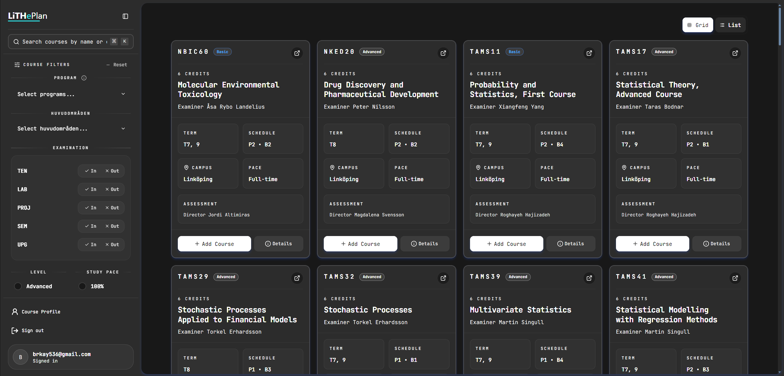

<div align="center">
  <picture>
    <source media="(prefers-color-scheme: dark)" srcset="public/LiTHePlan-white-transparent.png">
    <source media="(prefers-color-scheme: light)" srcset="public/LiTHePlan-transparent.png">
    
  </picture>
  
  # LiTHePlan
  
  **Intelligent course planning for Linköping University civil engineering students**
  
  [](https://nextjs.org/)
  [](https://react.dev/)
  [](https://www.typescriptlang.org/)
  [](https://supabase.com/)
  [](https://litheplan.tech)
  
  [Website](https://litheplan.tech) · [Report Bug](https://github.com/Berkay2002/LiTHePlan/issues) · [Request Feature](https://github.com/Berkay2002/LiTHePlan/issues)
</div>

---

## Overview

<div align="center">
  
</div>

LiTHePlan is a modern web application that solves the course planning challenge for Linköping University (LiTH) civil engineering master's students. With **339 curated courses** across **29 program specializations**, students can discover cross-disciplinary opportunities, build validated 90hp study plans, and share profiles with academic advisors.

### The Problem

- **Fragmented Information**: Course data scattered across multiple university systems
- **Poor Discoverability**: No efficient way to explore courses across different programs
- **Manual Validation**: Time-consuming spreadsheet planning with error-prone requirement checking
- **Limited Cross-Specialization**: Students miss opportunities outside their default track

### The Solution

- **Unified Course Catalog**: 339 master's level courses (terms 7-9) with advanced filtering
- **Interactive Profile Builder**: Visual drag-and-drop pinboard with real-time validation
- **Automatic Validation**: Ensures 90hp total and 60hp advanced-level requirements
- **Profile Sharing**: Cloud-synced profiles with unique URLs for advisor collaboration
- **Hybrid Storage**: Guest users get localStorage persistence, authenticated users get cloud sync

---

## Key Features

### Smart Course Discovery
- **Comprehensive Catalog**: 339 curated master's level courses (terms 7-9) from 29 program specializations
- **Advanced Filtering**: Multi-criteria search by term, level, block, pace, campus, and program
- **Dual View Modes**: Toggle between grid and list layouts with server-side pagination
- **Conflict Detection**: Automatically identifies and resolves mutually exclusive course selections
- **Course Details**: Enhanced metadata including examiner, study director, and subject area

### Interactive Profile Builder
- **Visual Pinboard**: Drag-and-drop interface for organizing courses across 3 semesters
- **Real-time Validation**: Instant feedback on credit totals and degree requirement compliance
- **Mobile Optimized**: Touch-friendly interactions with responsive design
- **Term Management**: Add, remove, and move courses between terms with validation

### Academic Requirements
- **Credit Tracking**: Automatic calculation of total (90hp) and advanced-level (60hp) credits
- **Validation Indicators**: Color-coded feedback (green = valid, yellow = warning, red = error)
- **Conflict Resolution**: Smart modal system for handling course conflicts
- **Swedish Terminology**: Preserves official LiU academic terms (grundnivå, avancerad nivå)

### Profile Management
- **Hybrid Storage Pattern**: 
  - **Guest Mode**: Profiles stored locally with full functionality, no signup required
  - **Authenticated Mode**: Cloud-synced via Supabase with cross-device access
  - **Graceful Fallback**: Automatic localStorage fallback if cloud sync fails
- **Profile Sharing**: Generate unique URLs to share study plans with advisors
- **Multi-Device Sync**: Real-time profile updates across browsers and devices

---

## Tech Stack

### Frontend
- **Next.js 16**
- **React 19.2**
- **TypeScript**
- **Tailwind CSS v4**
- **shadcn/ui** component library
- **Lucide React** icons

### Backend & Data
- **Next.js API Routes** for serverless backend
- **Supabase** (PostgreSQL)
- **Row-Level Security (RLS)** for data protection
- **Real-time Subscriptions** for profile sync

### State Management
- **React Context API**

---

## Project Structure

```
LiTHePlan/
├── app/                          # Next.js App Router
│   ├── page.tsx                 # Home page (course catalog)
│   ├── layout.tsx               # Root layout with ProfileProvider
│   ├── api/                     # API routes
│   │   ├── courses/route.ts    # Course filtering & pagination
│   │   ├── profile/route.ts    # Profile CRUD operations
│   │   └── auth/               # Supabase authentication
│   ├── login/                  # Authentication pages
│   ├── profile/                # Profile management
│   │   ├── [id]/page.tsx       # View shared profiles
│   │   └── edit/page.tsx       # Edit profile
│   └── course/[courseId]/      # Individual course pages
│
├── components/
│   ├── course/                 # Course discovery features
│   │   ├── CourseCard.tsx     # Course display component
│   │   ├── FilterPanel.tsx    # Multi-select filters
│   │   ├── ConflictResolutionModal.tsx
│   │   └── TermSelectionModal.tsx
│   ├── profile/               # Profile builder
│   │   ├── ProfileContext.tsx # Global state (CRITICAL)
│   │   ├── ProfilePinboard.tsx # Drag-drop interface
│   │   └── ProfileSidebar.tsx  # Credit tracking
│   ├── shared/                # Reusable components
│   │   ├── DynamicNavbar.tsx
│   │   ├── GlobalCommandPalette.tsx
│   │   └── AlertBanner.tsx
│   └── ui/                    # shadcn/ui primitives
│
├── lib/
│   ├── profile-utils.ts       # Profile CRUD logic
│   ├── course-conflict-utils.ts # Conflict detection
│   ├── api-validation.ts      # Zod schemas
│   ├── rate-limit.ts          # Redis rate limiting
│   └── logger.ts              # Structured logging
│
├── types/
│   ├── course.ts              # Course interfaces
│   └── profile.ts             # Profile state types
│
├── utils/supabase/
│   ├── client.ts              # Browser Supabase client
│   ├── server.ts              # Server Supabase client (SSR)
│   └── session.ts             # Auth utilities
│
├── proxy.ts                    # Auth session refresh (Next.js 16)
└── memory-bank/               # Project documentation
```

---

## 🗄 Database

### Course Database

**339 curated courses** from Linköping University's master's level programs (terms 7-9), covering **15 civil engineering programs** and additional specialization areas.

**Statistics:**
- **Advanced Level**: 79.4% (269 courses)
- **Basic Level**: 20.6% (70 courses)
- **Linköping Campus**: 83.2% (282 courses)
- **Norrköping Campus**: 15.6% (53 courses)
- **Standard 6hp Courses**: 89.7% (304 courses)

**Programs Covered:**
Civil engineering programs in Computer Science, Electrical Engineering, Mechanical Engineering, Industrial Engineering, Biomedical Engineering, Media Technology, Applied Mathematics, and more.

### Data Management

> **Note on Data Currency**: The course database is maintained through an automated crawler that runs periodically (every 3-6 months) to update course information, remove deprecated courses, and add new offerings. While this ensures reasonable data freshness, always verify critical course details with official Linköping University sources and your academic advisor before finalizing your study plan.

## Architecture Highlights

### Hybrid Storage Pattern

**The Challenge**: Balancing user experience (no signup friction) with data persistence and cross-device sync.

**The Solution**: Intelligent storage routing based on authentication state:

```typescript
const saveProfile = async (profile: StudentProfile) => {
  if (user) {
    // Authenticated: Cloud sync with localStorage fallback
    try {
      await supabase.from('academic_profiles').upsert({
        user_id: user.id,
        profile_data: profile
      });
    } catch (error) {
      // Graceful degradation to localStorage
      localStorage.setItem('profile', JSON.stringify(profile));
    }
  } else {
    // Guest: Always localStorage
    localStorage.setItem('profile', JSON.stringify(profile));
  }
};
```

**Benefits:**
- Zero friction for guest users
- Automatic upgrade to cloud sync on authentication
- Reliable fallback ensures no data loss
- Transparent to consuming components

### Server-Side Filtering

All course filtering happens in `/api/courses` using PostgreSQL:

```typescript
// Offloads filtering to database, reduces client bundle
const response = await fetch('/api/courses?term=7&level=avancerad+nivå');
const { courses, pagination } = await response.json();
```

**Performance:** Sub-500ms response times with pagination and caching.

### Conflict Detection System

Parses course `notes` field for restriction patterns:

```typescript
// Example: "The course may not be included in a degree together with: TSBK02"
const conflicts = findCourseConflicts(newCourse, currentProfile);
if (conflicts.length > 0) {
  // Show modal - user chooses to replace or cancel
  showConflictModal({ newCourse, conflicts });
}
```

**Prevents academic integrity violations** while maintaining user agency.

---

## 🔒 Security & Performance

### Security Measures
- **Row-Level Security (RLS)**: Users can only access their own profiles
- **Input Validation**: Zod schemas with strict mode prevent injection attacks
- **Rate Limiting**: Upstash Redis with sliding window algorithm
  - Courses API: 100 requests/minute per IP
  - Profile writes: 10 requests/minute per IP
- **HTTPS Only**: Enforced in production
- **No Sensitive Data**: Stack traces and debug info excluded from production responses

## 🤝 Contributing

This project was developed to improve student experience at Linköping University. Contributions that align with this educational mission are welcome.

### Development Guidelines
- Follow TypeScript strict mode (no `any` types)
- Maintain WCAG 2.1 AA accessibility standards
- Use Ultracite for code formatting (`npm run format`)
- Add tests for new features
- Ensure mobile responsiveness

### Pull Request Process
1. Fork the repository
2. Create a feature branch (`git checkout -b feature/amazing-feature`)
3. Commit changes following [Conventional Commits](https://www.conventionalcommits.org/)
4. Run linting and tests (`npm run lint && npm run build`)
5. Push to your fork and submit a pull request

---

## License

This project is developed for educational purposes at Linköping University.

---

<div align="center">
  <p>Built with ❤️ for Linköping University civil engineering students</p>
  <p>
    <a href="https://litheplan.tech">Live Demo</a> ·
    <a href="https://github.com/Berkay2002/LiTHePlan/issues">Report Bug</a> ·
    <a href="https://github.com/Berkay2002/LiTHePlan/issues">Request Feature</a>
  </p>
</div>
